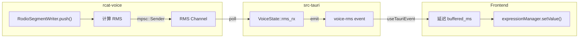

# RCAT VRM 透明桌宠 — 执行方案 v3（已校正）

## 0. 与另一份方案的对比

| 维度 | 我的方案 | 另一份方案 | 综合判断 |
|------|----------|------------|----------|
| **口型桥接** | 后端 RMS event（不改 Rodio） | "前端播放 or 低频事件"待定 | **我的更务实** |
| **架构拆分** | 4 模块 | 6 模块（含 voicePlayback 桥接） | **另一份更完整** |
| **皮肤系统** | 尽早引入（T0 起） | Optional | **我的更现实** |
| **dispose 强调** | 提到 | 作为 Constraint 强调 | **另一份更细致** |
| **Open Questions** | 直接给出推荐 | 列出待定 | **我的更决断** |

---

## 1. Requirements（需求规格）

### 1.1 渲染层

| ID | 需求 | 验收标准 |
|----|------|----------|
| R1.1 | 透明 VRM 层 | WebGL `alpha: true` + `setClearColor(0x000000, 0)` |
| R1.2 | click-through 兼容 | 现有 `set_ignore_cursor_events` 行为不变 |
| R1.3 | 最小舞台 | 仅相机/灯光/渲染循环/VRM 骨骼更新 |
| R1.4 | 显式卸载 | `dispose()` 所有 geometry/material/texture |

### 1.2 行为通道

| ID | 通道 | 优先级 | 验收标准 |
|----|------|--------|----------|
| R2.1 | Expression | P0 | 情绪表情可写入，不与 procedural 冲突 |
| R2.2 | LookAt | P0 | 屏幕中心 + 微扰（click-through 下无鼠标事件） |
| R2.3 | Blink | P0 | 随机间隔 2-5s，快闭慢开 |
| R2.4 | LipSync | P0 | V0: RMS → `aa` |

### 1.3 口型策略

| 阶段 | 实现 | 验收标准 |
|------|------|----------|
| V0 | RMS + gate (< 0.02) + attack/release | 嘴张不抖、停音后闭合 |
| V1 | FFT → 5 元音（可选） | 口型横向/圆唇变化 |

---

## 2. 音频桥接架构（核心修正）

> [!IMPORTANT]
> **修正点**：用户正确指出 `AudioBuffer::write` 不存在；RMS 应在 `RodioSegmentWriter.push()` 中计算。

### 2.1 RMS 计算位置

```
rcat-voice/src/audio/rodio.rs
  └── RodioSegmentWriter.push(&mut self, samples: &[f32], ...) [L164-195]
      └── 在这里计算 RMS，通过 channel 发送到 Tauri 层
```

### 2.2 时间对齐策略

> [!WARNING]
> **风险**：[push()](file:///e:/rcat/rcat-voice/src/audio/rodio.rs#164-196) 写入时 emit RMS 会导致嘴提前于声音（buffer/prefill 造成前置）

**解决方案**：
- [buffered_ms()](file:///e:/rcat/rcat-voice/src/audio/mod.rs#77-81) 方法已存在（L149-156）
- event 携带 [buffered_ms](file:///e:/rcat/rcat-voice/src/audio/mod.rs#77-81) 字段，前端做延迟对齐

```rust
// voice-rms event payload
VoiceRmsPayload {
    rms: f32,
    peak: f32,
    buffered_ms: u64,  // 关键：前端需要延迟 buffered_ms 再应用
    speaking: bool,
}
```

**前端延迟对齐（建议实现方式）**：
- 收到 event 时计算 `applyAt = performance.now() + buffered_ms`，入队列
- rAF 中每帧取 `applyAt <= now` 的**最新一条**应用到 VRM（丢弃过期旧值）
- 收到 `speaking=false`（或 `voice_stop`）时立刻清空队列并强制口型归零（避免“嘴悬空”）

### 2.3 OS TTS 降级

> [!CAUTION]
> OS TTS 无法获取 PCM，因此 **无法支持 LipSync**。

**策略**：
- `TTS_BACKEND=os` 时，前端检测并禁用口型驱动
- VRM 仍可展示眨眼/视线/情绪，但嘴不动
- 或强制 `VOICE_PLAY_USE_STREAM=1`（仅限支持流式的 TTS）

### 2.4 channel 传递方案



**实现细节**：
> [!NOTE]
> 现状：`src-tauri` 通过 `rcat_voice::generator::build_from_env()` 构建引擎，而音频后端在 `rcat-voice` 内部 `audio::build_from_env()` 创建；因此 **仅在 `src-tauri` 里“手动构建 RodioBackend 并注入 tx”是不够的**，必须把 tx 注入链路接到 `rcat-voice` 的构建入口上。

1. `rcat-voice`：新增 `audio::build_from_env_with_rms_sender(tx)`（仅 rodio 生效；其它音频后端忽略 tx、不发送 RMS）
2. `rcat-voice`：新增 `generator::build_from_env_with_audio(audio)`（或 `build_from_env_with_rms_sender(tx)`）供 `src-tauri` 调用
3. `rcat-voice`：[RodioSegmentWriter](file:///e:/rcat/rcat-voice/src/audio/rodio.rs#29-36) 在 [push()](file:///e:/rcat/rcat-voice/src/audio/rodio.rs#164-196) 中**按固定窗/限频**（例如 1024 samples 或 ~30Hz）计算 RMS，并 `tx.try_send(payload)`
4. `src-tauri`：[VoiceState](file:///e:/rcat/src-tauri/src/services/voice.rs#9-14) 新增 `rms_rx`，后台 poll 并 `app.emit("voice-rms", ...)`
5. `Frontend`：订阅 `voice-rms`，按 `buffered_ms` 调度应用；收到 `speaking=false` 立即闭嘴并清队列

---

## 3. Constraints（约束）

| ID | 约束 | 处理方式 |
|----|------|----------|
| C1 | VRM procedural 冲突 | AvatarController 优先级覆盖 |
| C2 | three-vrm 加载范式 | GLTFLoader + VRMLoaderPlugin |
| C3 | 交互两态 | 只做全局 click-through 开关 |
| C4 | WebGL 内存泄漏 | 显式 `dispose()` |
| C5 | IPC 大数据传输 | 走 event，不传 audio bytes |
| **C6** | **click-through 下无鼠标事件** | LookAt 用屏幕中心 + Perlin noise |
| **C7** | **OS TTS 无 PCM** | 降级：禁用口型或提示用户切 backend |
| **C8** | **GLTFLoader 无内置 abort** | 需显式 AbortController + 超时忽略 |

---

## 4. click-through 策略（修正）

> [!WARNING]
> **问题**：
> 1. click-through 时前端拿不到鼠标事件，mouse-follow 失效
> 2. click-through 下 Capsule 也不可点击，"半透明入口"无法退出

**解决方案**：

### 4.1 LookAt 策略
- **默认**：屏幕中心 + 轻微 Perlin noise（伪随机漂移）
- **可选**（非 click-through 时）：鼠标跟随
- **可选**（需系统权限）：Tauri 侧调用 `GetCursorPos` polling

### 4.2 退出 click-through
- **主入口**：托盘菜单（已有）
- **备选**：全局热键（需新增）
- Capsule 在 click-through 时 **不应被视为可用入口**

---

## 5. Architecture 模块清单（修正路径）

| 模块 | 职责 | 文件 |
|------|------|------|
| VrmRenderer | 创建 WebGLRenderer/相机/灯光/加载卸载 | `src/components/vrm/useVrmRenderer.ts` |
| VrmCanvas | React 组件壳 | `src/components/vrm/VrmCanvas.tsx` |
| AvatarController | 合成 Idle→Gaze→Blink→Expression→Mouth | `src/components/vrm/AvatarController.ts` |
| ExpressionDriver | 封装 setValue + 缺失 preset 容错 | `src/components/vrm/ExpressionDriver.ts` |
| useLipSync | 订阅 voice-rms + 延迟对齐 + 平滑 | `src/components/vrm/useLipSync.ts` |
| useBlink | 随机眨眼 | `src/components/vrm/useBlink.ts` |
| useLookAt | 屏幕中心 + noise | `src/components/vrm/useLookAt.ts` |
| SkinManager | 皮肤切换、降级 | `src/components/skins/SkinManager.ts` |
| **RodioBackend 扩展** | RMS channel 注入 | [rcat-voice/src/audio/rodio.rs](file:///e:/rcat/rcat-voice/src/audio/rodio.rs) |
| **VoiceState 扩展** | RMS receiver + emit | [src-tauri/src/services/voice.rs](file:///e:/rcat/src-tauri/src/services/voice.rs) |

---

## 6. Tasks（修正版）

### T0: VRM 透明渲染 + 皮肤开关 ⏱️ 2 天

**变更**：
- `bun add three @pixiv/three-vrm @types/three`
- 新增 `src/components/vrm/` 目录
- 新增 `public/vrm/default.vrm`
- 新增最小 `SkinManager`（暂只支持 `vrm | off`）
- 修改 [src/App.tsx](file:///e:/rcat/src/App.tsx) 条件渲染 `<VrmCanvas />`

**VRM 加载超时**：
```typescript
// 5s timeout via AbortController:
// GLTFLoader.load/loadAsync 不支持 signal，必须 abort fetch 再 parseAsync
const controller = new AbortController();
const timeout = setTimeout(() => controller.abort(), 5000);
try {
  const res = await fetch(url, { signal: controller.signal });
  const buf = await res.arrayBuffer();
  const gltf = await loader.parseAsync(buf, baseUrl);
  // ... scene.add(vrm.scene)
} finally {
  clearTimeout(timeout);
}
// 如果 abort，忽略结果并 dispose 已加载的部分
```

**DoD**：
- [x] VRM 在透明窗口中显示
- [x] 设置中可开关 VRM
- [x] 5s 加载超时正确 fallback

---

### T1: 表情管理 + Debug 面板 ⏱️ 1 天

（内容不变）

---

### T2: 眨眼 + 视线 ⏱️ 1 天

**LookAt 修正**：
- 不依赖鼠标事件
- 默认：屏幕中心 + Perlin noise 伪随机
- 可选：非 click-through 时监听 mousemove

**DoD**：
- [x] 自动眨眼
- [x] 视线微漂移（无需鼠标）
- [x] 情绪表情同时启用时无穿模

---

### T3: LipSync V0 ⏱️ 3-4 天

**修正变更**：
- 修改 [rcat-voice/src/audio/rodio.rs](file:///e:/rcat/rcat-voice/src/audio/rodio.rs)：
  - `RodioBackend::from_config()` 接受 `Option<mpsc::Sender<RmsPayload>>`
  - `RodioSegmentWriter.push()` 中**按固定窗/限频**计算 RMS 并 `tx.try_send()`
- 修改 `rcat-voice/src/audio/mod.rs`：
  - 新增 `build_from_env_with_rms_sender(tx)`，把 tx 注入到 RodioBackend
- 修改 `rcat-voice/src/generator/mod.rs`：
  - 新增 `build_from_env_with_audio(audio)`（或 `build_from_env_with_rms_sender(tx)`），让上层可注入音频后端
- 修改 [src-tauri/src/services/voice.rs](file:///e:/rcat/src-tauri/src/services/voice.rs)：
  - [VoiceState](file:///e:/rcat/src-tauri/src/services/voice.rs#9-14) 新增 `rms_tx/rms_rx`
  - 用 `build_from_env_with_*` 构建引擎（确保 tx 真正进入 rcat-voice 音频链路）
  - 新增 background task poll `rms_rx` 并 `app.emit("voice-rms", ...)`
- 新增 `src/components/vrm/useLipSync.ts`：
  - 订阅 `voice-rms`
  - **延迟 [buffered_ms](file:///e:/rcat/rcat-voice/src/audio/mod.rs#77-81) 后再应用**（时间对齐）
  - attack/release 平滑

**OS TTS 降级**：
- 检测 `TTS_BACKEND=os` 时，前端显示提示并禁用口型

**DoD**：
- [x] 说话时嘴张开，时间对齐
- [x] 停音后 150ms 内闭合
- [x] OS TTS 时优雅降级

---

### T4: 皮肤系统完善 ⏱️ 2 天

**变更**：
- `SkinManager` 扩展：`orb | vrm | auto`
- auto 策略：speaking → VRM
- 降级保护：VRM 失败 / FPS < 20 / context loss → Orb

---

### T5: LipSync V1（可选）⏱️ 3 天

（前置条件：V0 效果不满意时再做）

---

## 7. Open Questions — 明确回答

| 问题 | 回答 | 理由 |
|------|------|------|
| LipSync 桥接 | 后端 RMS event + channel | 不改 Rodio 播放 |
| 时间对齐 | event 带 [buffered_ms](file:///e:/rcat/rcat-voice/src/audio/mod.rs#77-81)，前端延迟 | 嘴不会提前于声音 |
| LookAt 在 click-through | 屏幕中心 + noise | 前端拿不到鼠标事件 |
| click-through 退出 | 托盘 / 热键（非 Capsule） | Capsule 也不可点击 |
| OS TTS | 降级禁用口型 | 拿不到 PCM |
| VRM 加载超时 | AbortController + 忽略 + dispose | GLTFLoader 无内置 |
| VRM 资产 | 内置默认 + 用户选择 | — |
| VRM 运行时机 | auto: speaking → VRM | 最大化性能 |

---

## 8. 时间线

```
T0 (2d): VRM 渲染 + 皮肤开关
T1 (1d): 表情管理
T2 (1d): 眨眼 + 视线
T3 (4d): LipSync V0（含 channel 改造）
T4 (2d): 皮肤系统完善
────────────────────────────────
最小闭环: 10 天
```
